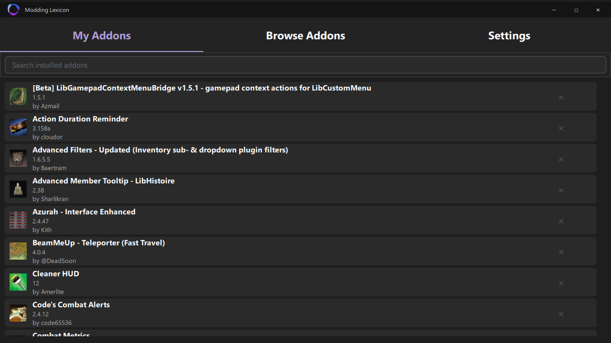
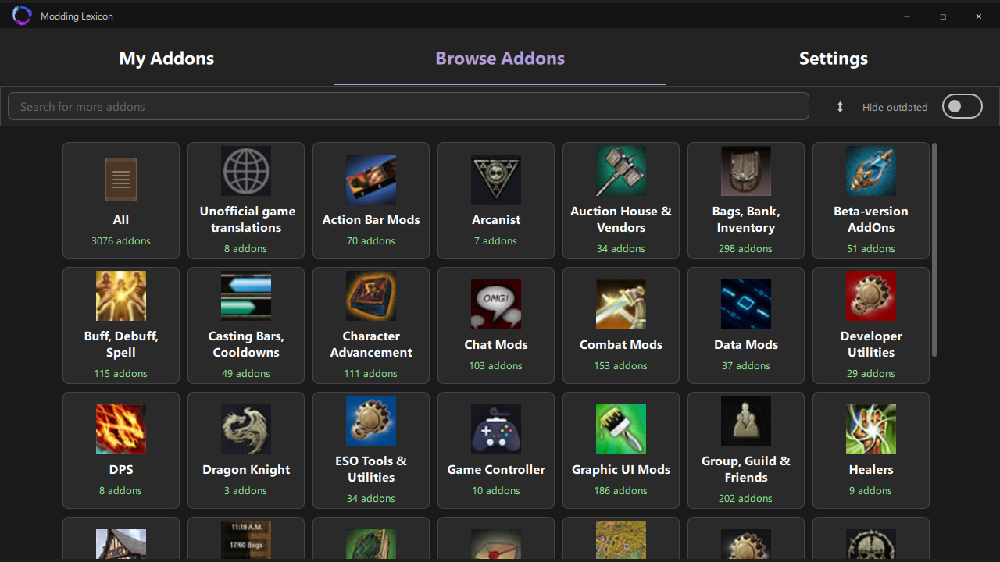
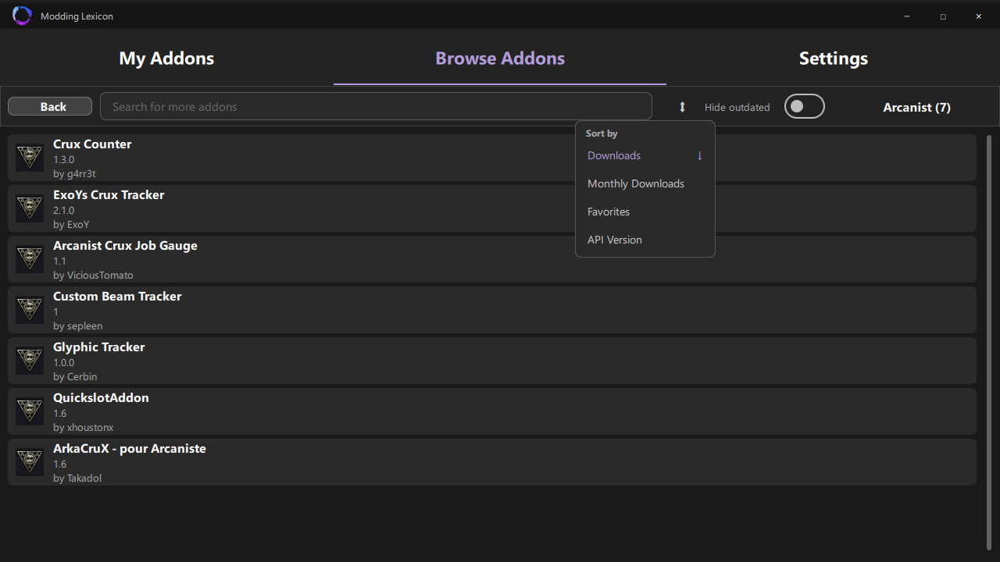

# 
Modding Lexicon

## 
 An Elder Scrolls Online Addon Manager

    <b>The right addon manager for everyone</b> 
    Find, install, update, and manage your addons in a modern, fast, and easy way.

## Features

- **Browse thousands of addons** — search full ESOUI catalog
- **Dependency resolution** — required libraries are installed alongside your addons
- **Clean libraries** - no more cluttered addons folder with unused libraries
- **ESOUI links** — open any addon's ESOUI page directly from the details window
- **Game version display** — see which game version each addon targets

## Acknowledgments

- [ESOUI.com](https://www.esoui.com) — addons
- [MMOUI.com](https://www.mmoui.com) — game config API
- [Qt Framework](https://www.qt.io) — UI toolkit
- [spdlog](https://github.com/gabime/spdlog) — logging

---

## License

MIT
